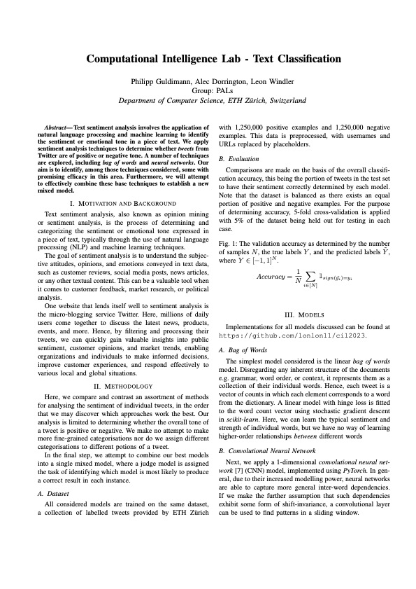
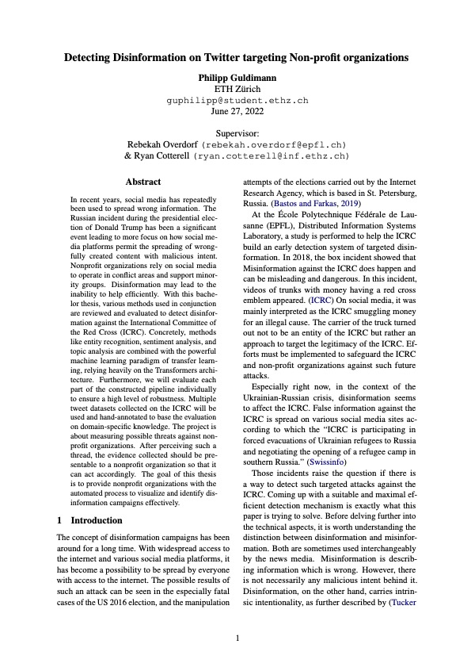

# Computer Scientist

Welcome to my portfolio website! My name is Philipp Guldimann, and I'm currently a student at ETH Zurich, where I am deeply immersed in the fascinating world of machine learning. This website serves as a window into my academic journey and my passion for the cutting-edge developments in this field.

Machine learning is not just a subject of study for me; it's a driving force that fuels my curiosity and shapes my academic pursuits. Through this portfolio, I aim to share my experiences, projects, and insights, which I've gathered while exploring the diverse realms of machine learning. Whether it's delving into complex algorithms, building intelligent models, or solving real-world problems, I'm committed to pushing the boundaries of what's possible.

As you navigate through these pages, you'll find a glimpse of my projects, research endeavors, and the skills I've honed during my time at ETH Zurich. I'm passionate about the transformative potential of machine learning, and I'm eager to collaborate with like-minded individuals and organizations that share this vision.

#### Technical Skills: Python, PyTorch, Tensorflow, wandb

## Education						       		
- M.Sc., Computer	Science | ETH Zürich (_September 2018_  - _August 2022_)	 			        		
- B.Sc., Comptuer Science | ETH Zürich (_August 2022_ - _August 2024_)

## Projects
### Computational Intelligence - Text Classification
[Report](./assets/pdf/CIL_2023.pdf)
 

### Decoding Physical and Cognitive Impacts of Particulate Matter Concentrations at Ultra-Fine Scales
[Bachelor Thesis](./assets/pdf/Bachelorthesis.pdf)
 

