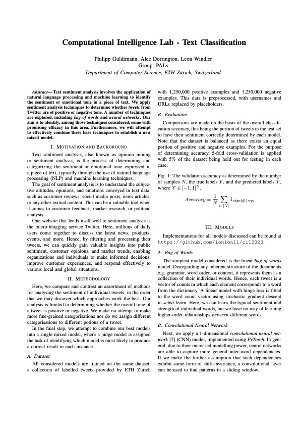
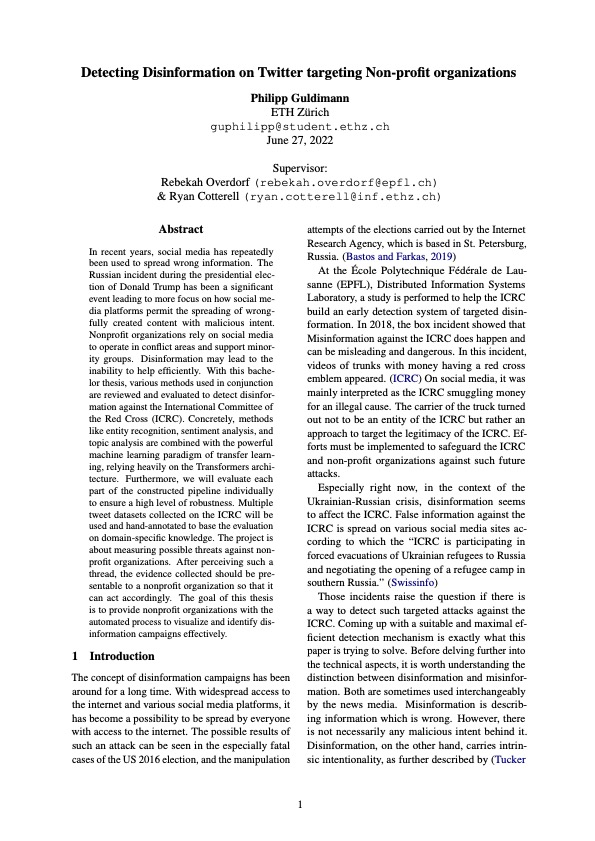

# Philipp Guldimann
### Data & ML Systems Engineer · Zürich, Switzerland

[GitHub](https://github.com/philipplukas) · [LinkedIn](https://linkedin.com/in/philipplukas) · [Email](mailto:phil.guldimann@gmail.com)

I build evaluation and data infrastructure for AI products — from zero to production. At a Zürich AI startup I built LLM evaluation infrastructure (23 evaluators, 10+ models assessed) that cut QA cycles from two days to four hours, and I'm now building multi-jurisdiction legal AI pipelines that process roughly one million documents across three countries. I hold an MSc in Machine Intelligence from ETH Zürich, and I care about pragmatic, scalable systems that ship and prove their value with metrics.

#### Technical focus
LLM evaluation · RAG systems · Data pipelines · MLOps · TypeScript / Python · AWS / Azure

---

## Experience

### Data Engineer — Omnilex
*Feb 2026 – Present · Zürich, Switzerland*

- Built ingestion and transformation pipelines for legal content across 3 jurisdictions (Switzerland, Germany, Austria), processing ~1M documents from APIs, scraping outputs, and bulk sources.
- Developed TypeScript-based data workflows for normalization, citation-aware chunking, embeddings, classification, and entity extraction.
- Contributed to RAG-ready indexing and Azure-based search infrastructure for precise, traceable legal AI responses.
- Introduced data contracts and validation checks that caught 50K+ duplicate entries before they reached production.

### Machine Learning Engineer — LatticeFlow AI
*Jan 2025 – Nov 2025 · Zürich, Switzerland*

- Built v0 evaluation infrastructure for a new AI product from scratch: 23 evaluators, integrations with multiple data and chat-model providers, assessing 10+ LLMs.
- Automated evaluation workflows for QA and regression testing, reducing review cycles from ~2 days of manual inspection to ~4 hours.
- Extended evaluators with targeted dataset generation to increase coverage across model behaviours and failure modes.

---

## Research & Publications

### COMPL-AI — A Benchmarking Framework for Evaluating LLM Compliance with the EU AI Act
*Research Intern, Secure Reliable Intelligence Lab, ETH Zürich (Oct 2023 – Mar 2024)*

Core contributor to COMPL-AI, evaluating 10+ models across 20 benchmarks spanning capabilities, cybersecurity, privacy, and bias/fairness. Worked on benchmark design, evaluation pipelines, and model integration via Hugging Face Transformers.

[Read the paper (arXiv:2410.07959)](https://arxiv.org/abs/2410.07959) · [Code on GitHub](https://github.com/compl-ai)

---

## Education

- **MSc Computer Science — Machine Intelligence**, ETH Zürich *(Sept 2022 – Dec 2024)*
  Thesis (top grade): *Speech Recognition for Children with Congenital Disorders Using Adaptive Methods.*
- **BSc Computer Science**, ETH Zürich *(Sept 2018 – Aug 2022)*
  Thesis (top grade): *Detecting Disinformation on Twitter Targeting Non-Profit Organisations* (in collaboration with the ICRC).

---

## Technical Skills

- **Languages:** Python, TypeScript / JavaScript, SQL
- **LLM / AI:** LLM evaluation, RAG, embeddings, Hugging Face Transformers, LangChain / LangGraph, MCP, PyTorch
- **Data & orchestration:** Airflow, Dagster, vector databases (FAISS, Weaviate, Pinecone), PostgreSQL
- **Backend & cloud:** FastAPI, Node.js, Docker, Kubernetes, AWS, Azure, CI/CD

---

## Earlier Projects

### Computational Intelligence Lab — Text Classification (ETH, 2023)
[Report (PDF)](./assets/pdf/CIL_2023.pdf)

### Bachelor Thesis — Detecting Disinformation on Twitter
[Thesis (PDF)](./assets/pdf/Bachelorthesis.pdf)

